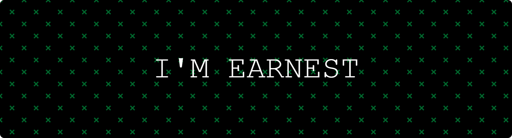

<h1 align="center">
  
</h1>

  

  
  
  
  

  

  

  

## 👤 About Me

- 🎓 Pursuing B.Tech in Artificial Intelligence & Data Science (2023–2027) at **Karunya Institute of Technology and Sciences**
- ⚙️ Building real-time data pipelines, IoT-based monitoring, and AI-powered decision tools
- 💻 Skilled in **React JS**, **Python**, **Power BI**, **PostgreSQL**
- 🚀 Exploring: AI Chatbots, Data Visualization, IoT Analytics, and Full Stack AI Systems

---

## 💡 In My Own Words

  

---

## 🖥️ Dev Machine

  
  
  
  
   
  

---

## 🧰 Languages & Tools

  

---

## 📊 GitHub Stats

  
  

  

  

<picture>
  <source media="(prefers-color-scheme: dark)"
          srcset="https://raw.githubusercontent.com/earnest-s/earnest-s/output/pacman-contribution-graph-dark.svg">
  <source media="(prefers-color-scheme: light)"
          srcset="https://raw.githubusercontent.com/earnest-s/earnest-s/output/pacman-contribution-graph.svg">
  
</picture>

